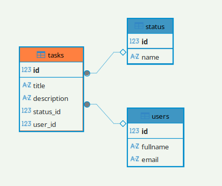

# goit-cs-hw-03

## task01

### run postgres docker container

https://hub.docker.com/_/postgres

```
docker run --name task01-postgres -e POSTGRES_PASSWORD=mysecretpassword -p 5432:5432 -d postgres

```

check is postgress running

```
sudo netstat -tunlp | grep 5432

tcp        0      0 0.0.0.0:5432            0.0.0.0:*               LISTEN      38166/docker-proxy
```

### connect to postgres

-   host: localhost
-   port: 5432
-   user: postgres
-   password: mysecretpassword

### connect to container

```
docker exec -it task01-postgres psql -U postgres
```

### stop container

```
docker stop task01-postgres
```

### start container

```
docker stop task01-postgres
```

### psql

#### show databases

```
postgres=# \l
                                                    List of databases
   Name    |  Owner   | Encoding | Locale Provider |  Collate   |   Ctype    | Locale | ICU Rules |   Access privileges
-----------+----------+----------+-----------------+------------+------------+--------+-----------+-----------------------
 postgres  | postgres | UTF8     | libc            | en_US.utf8 | en_US.utf8 |        |           |
 template0 | postgres | UTF8     | libc            | en_US.utf8 | en_US.utf8 |        |           | =c/postgres          +
           |          |          |                 |            |            |        |           | postgres=CTc/postgres
 template1 | postgres | UTF8     | libc            | en_US.utf8 | en_US.utf8 |        |           | =c/postgres          +
           |          |          |                 |            |            |        |           | postgres=CTc/postgres
(3 rows)

```

#### show tables

```
\dt

         List of relations
 Schema |  Name  | Type  |  Owner
--------+--------+-------+----------
 public | status | table | postgres
 public | tasks  | table | postgres
 public | users  | table | postgres
(3 rows)

```

```
SELECT table_name
FROM information_schema.tables
WHERE table_schema = 'public';

 table_name
------------
 status
 tasks
 users
(3 rows)

```

#### show tables descriptions

```
postgres=# \d status
                                   Table "public.status"
 Column |         Type          | Collation | Nullable |              Default
--------+-----------------------+-----------+----------+------------------------------------
 id     | integer               |           | not null | nextval('status_id_seq'::regclass)
 name   | character varying(50) |           | not null |
Indexes:
    "status_pkey" PRIMARY KEY, btree (id)
    "status_name_key" UNIQUE CONSTRAINT, btree (name)
Referenced by:
    TABLE "tasks" CONSTRAINT "tasks_status_id_fkey" FOREIGN KEY (status_id) REFERENCES status(id)

postgres=# \d tasks
                                      Table "public.tasks"
   Column    |          Type          | Collation | Nullable |              Default
-------------+------------------------+-----------+----------+-----------------------------------
 id          | integer                |           | not null | nextval('tasks_id_seq'::regclass)
 title       | character varying(100) |           | not null |
 description | text                   |           |          |
 status_id   | integer                |           |          |
 user_id     | integer                |           |          |
Indexes:
    "tasks_pkey" PRIMARY KEY, btree (id)
Foreign-key constraints:
    "tasks_status_id_fkey" FOREIGN KEY (status_id) REFERENCES status(id)
    "tasks_user_id_fkey" FOREIGN KEY (user_id) REFERENCES users(id) ON DELETE CASCADE


postgres=# \d users
                                     Table "public.users"
  Column  |          Type          | Collation | Nullable |              Default
----------+------------------------+-----------+----------+-----------------------------------
 id       | integer                |           | not null | nextval('users_id_seq'::regclass)
 fullname | character varying(100) |           | not null |
 email    | character varying(100) |           | not null |
Indexes:
    "users_pkey" PRIMARY KEY, btree (id)
    "users_email_key" UNIQUE CONSTRAINT, btree (email)
Referenced by:
    TABLE "tasks" CONSTRAINT "tasks_user_id_fkey" FOREIGN KEY (user_id) REFERENCES users(id) ON DELETE CASCADE
```

#### get information about foreign keys and relationships

```
postgres=# SELECT
    tc.table_name AS child_table,
    kcu.column_name AS child_column,
    ccu.table_name AS parent_table,
    ccu.column_name AS parent_column
FROM
    information_schema.table_constraints AS tc
JOIN
    information_schema.key_column_usage AS kcu
    ON tc.constraint_name = kcu.constraint_name
JOIN
    information_schema.constraint_column_usage AS ccu
    ON ccu.constraint_name = tc.constraint_name
WHERE
    constraint_type = 'FOREIGN KEY';

 child_table | child_column | parent_table | parent_column
-------------+--------------+--------------+---------------
 tasks       | status_id    | status       | id
 tasks       | user_id      | users        | id
(2 rows)

```

### DB diagram



### create postgresql container and tables

[createdb.sh](./task01/createdb.sh)

### fill tables with faker

```
pip install faker
```

[seed.py](./task01/seed.py)
